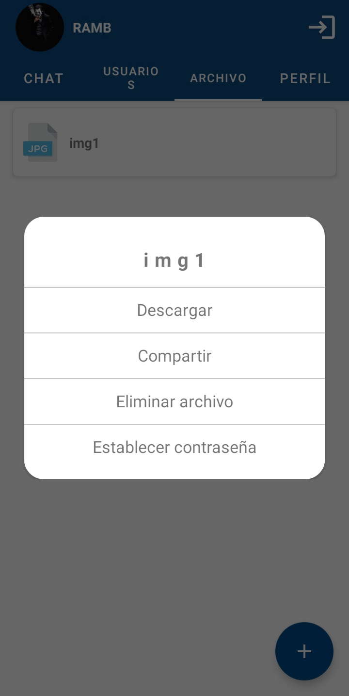

  

<h1 align="center">
  CRYPT
</h1>

 

 Android Studio

 

Firebase

## Description

CRYPT es una aplicacion movil que busca ayudar al usuario a proteger sus archivos 
y mantener conversasiones seguras con los demas usuarios en la aplicación ya que 
cuenta con un gestor de archivos que te como opcion poner una contraseña a los 
archivos que subas, esta contraseña se mantiene al compartir el archivo con otro
usuario.

## Vistas
### Gestor de archivos

  
  
  
  

### Chats

  
  
  

